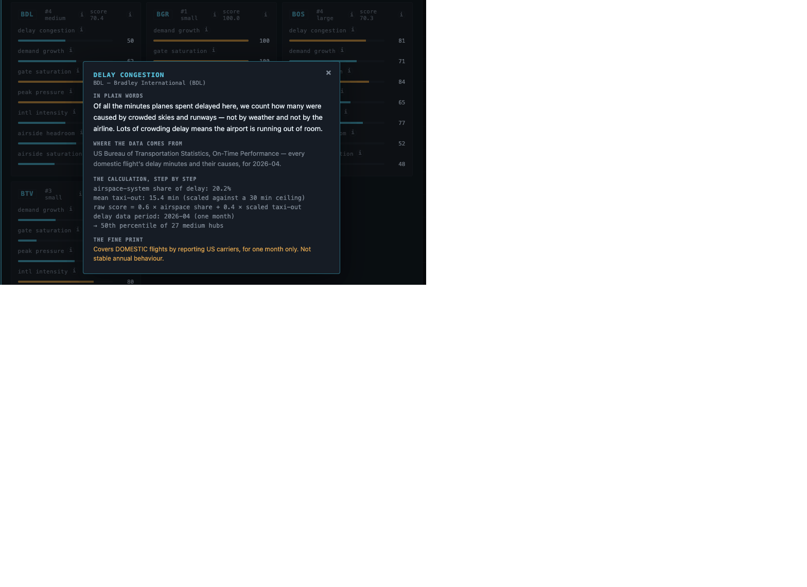
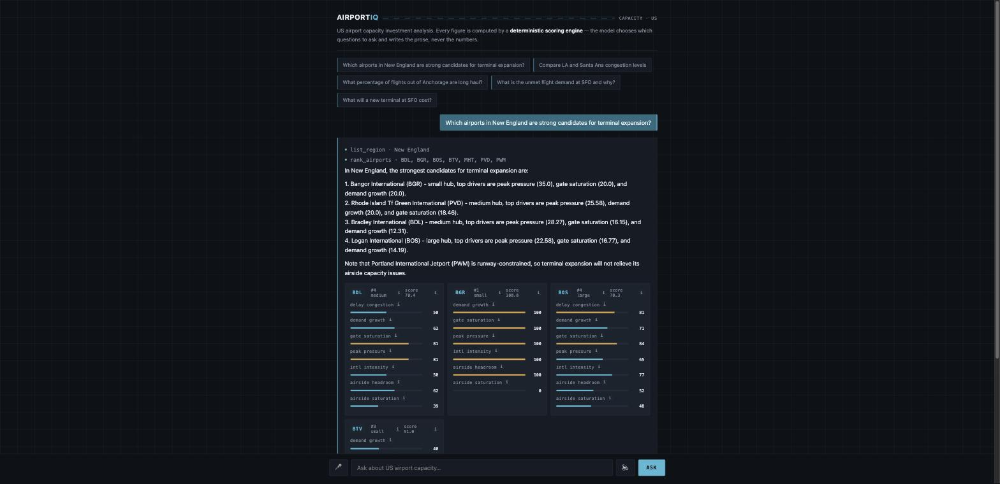
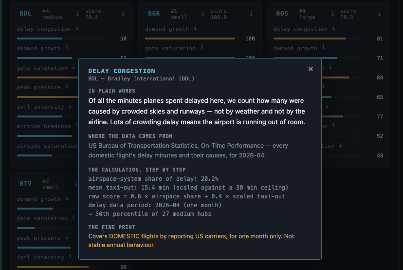
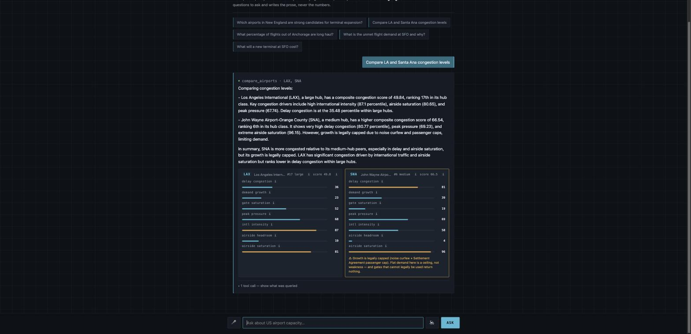
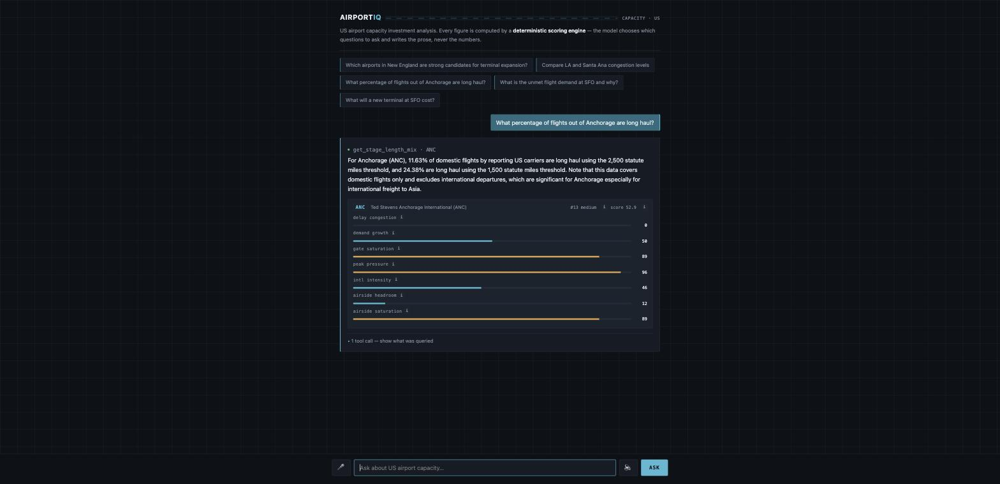

# AirportIQ

An agent that ranks US airports as candidates for capacity investment, from public aviation data.



Ask it questions like:

- *Which airports in New England are strong candidates for terminal expansion?*
- *Compare LA and Santa Ana airport congestion levels.*
- *What percentage of flights out of Anchorage are long haul?*
- *What is the unmet flight demand at SFO and why?*

## What it looks like

**The tool calls are streamed live, as the agent decides to make them.** The interesting
latency here is not token generation, it is the agent going away to query things — so that is
what the interface shows. You watch it resolve the region *before* ranking, rather than staring
at a spinner.



**Every number can be interrogated.** Each metric carries an ⓘ that explains it in plain words,
names the source, shows the arithmetic step by step, and states the fine print — including the
inconvenient parts, like the delay data covering one month of domestic flights only.

An analyst who cannot see how a score was produced has to take it on faith, and a score taken on
faith is not usable in an investment decision. So the explanation is part of the product rather
than part of the documentation:



**Every answer carries the engine's own numbers.** The percentile bars beneath the prose come
straight from the deterministic scoring engine, so the sentence can be checked against the data
that produced it in one glance. The panel is built server-side from the *tool-call arguments* —
never by parsing the model's text, which would agree with itself by construction.

Amber is reserved exclusively for constraint flags. An amber card means that airport is legally
or physically capped, which changes the recommendation no matter how good its other metrics look:



**Uncertainty is stated, not buried.** "Long haul" has no single definition, so both thresholds
are always returned — the answer nearly doubles between them, and hiding that would let the
threshold masquerade as a finding. The domestic-only scope caveat matters most at exactly the
airport being asked about, since Anchorage's real long-haul traffic is international freight:



## Run it

```bash
python scripts/build_and_rank.py --profile terminal_expansion   # no LLM, no API key needed
python run_tests.py                                             # 32 tests, no framework needed
cp .env.example .env                                            # add ONE key for the chat agent
python -m airportiq.api.server                                  # then open http://localhost:8000
python scripts/ask.py "Which New England airports need terminal expansion?"
```

There is deliberately **no test framework**. This project claims to run on a clean clone with
nothing installed, and a `pytest` dependency would falsify that claim in the one place it would
be most embarrassing — the suite that exists to verify it. `run_tests.py` is forty lines of
stdlib. CI runs the same command on Python 3.10 through 3.13.

`build_and_rank.py` runs with **no API key at all** — the scoring path contains no model.
A committed snapshot (`data/snapshots/`) means it also runs with **no network**.

Any one of `OPENAI_API_KEY`, `GROQ_API_KEY`, `GOOGLE_API_KEY` or `ANTHROPIC_API_KEY` works;
Groq and Gemini have free tiers that are ample here. Set `LLM_PROVIDER` / `LLM_MODEL` to choose.

## The one thing worth looking at first

`tests/test_purity.py` walks the AST of the scoring package and **fails the build** if it
imports any LLM library, any network library, or even `datetime`.

That is the mechanical answer to "the scoring must be deterministic, not only LLM output". The
model classifies intent and phrases the answer. It never touches the arithmetic — and that is
enforced, not intended.

To see it for yourself: run `build_and_rank.py` (pure, no model) and then ask the agent the same
question. Identical numbers, because it is the same function.

## Data

**BTS T-100 Segment Summary by Origin Airport** via the Socrata API — public, keyless,
~131,700 rows, currently through 2026-04 (roughly a four-month lag).

Three things that will bite anyone reusing this source, all handled at the boundary in
`data/bts.py`:

1. The filter field is `origin_airport_code`. Using `origin` returns HTTP 400.
2. Every value returns as a **string**, including numerics. Coercion failure becomes `None`
   ("unknown"), never `0.0` ("we know it is zero") — a missing load factor read as zero would
   rank a data gap as perfectly uncongested.
3. Socrata **omits null fields entirely** from a row, so small airfields return no international
   keys at all. Never assume a key exists.

And the schema trap that silently corrupts totals:

```
domestic_passengers + outbound_international_1 = total_passengers    (exact)
```

`total_*` is departure-based (≈ enplanements). `inbound_international_*` is a **separate arrivals
block, not part of the total**. Summing everything matching "international" inflates SFO by
about a third.

## Interface

Plain HTML/CSS/JS — no build step, no CDN, no npm install before a reviewer can see anything.

- **Streaming** over Server-Sent Events. Tool calls appear as they happen; the answer streams in
  token by token.
- **Voice** via the browser's own Web Speech API — no key, no cloud STT vendor, no dependency.
  Each leg is feature-detected separately, so a browser with synthesis but not recognition gets
  spoken answers rather than a dead microphone.
  One deliberate asymmetry: voice *input* is the whole question, but voice *output* is the prose
  answer only. The trace and the caveats are never read aloud — reading a list of caveats aloud
  is how a listener stops hearing them.
- **`/v1/score`** returns the full ranking with **no API key and no model involved at all**, so
  every figure the agent quotes can be reproduced independently.

## What it does not do

It does not rank profitability — that needs construction cost, land and lease data that are not
public. It ranks *investment-worthiness signal*: demand pressure against physical and legal
capacity, which is the input to a profitability model rather than the model itself.

Full reasoning, weights, and the complete limitations list are in [DESIGN.md](DESIGN.md).
